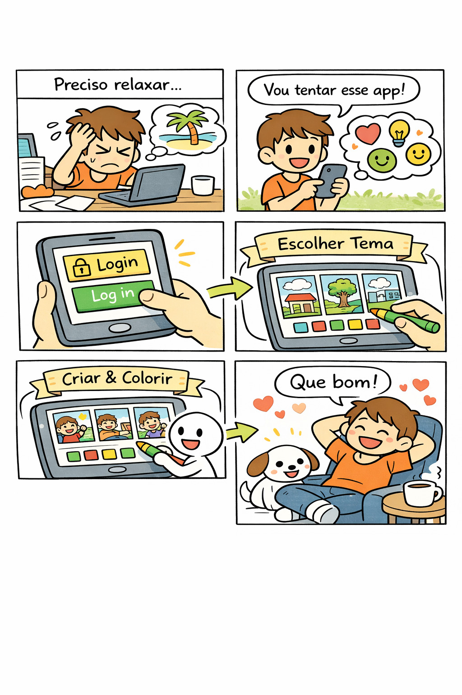

# 1.1. Módulo Design Sprint

## Introdução

O *Design Sprint* é uma metodologia ágil de cinco dias criada pelo Google Ventures para acelerar o processo de validação de ideias e solução de problemas complexos através de prototipagem e testes com usuários reais<a id="anchor_1" href="#REF1">^1^</a>. Esta abordagem permite que equipes multidisciplinares colaborem de forma estruturada para desenvolver, prototipar e testar soluções inovadoras em um curto período de tempo.

No contexto do **MinhaTirinha**, o Design Sprint foi essencial para definir a proposta de valor do aplicativo: uma ferramenta de entretenimento focada no alívio do estresse através da pintura de histórias em quadrinhos.

## Metodologia

A metodologia do Design Sprint foi aplicada pelo nosso grupo seguindo as cinco etapas fundamentais: **Mapear**, **Esboçar**, **Decidir**, **Prototipar** e **Testar**.

## Participantes

<table>
  <thead>
    <tr>
      <th>Nome</th>
      <th>Função</th>
      <th>Data</th>
    </tr>
  </thead>
  <tbody>
    <tr>
      <td><a href="https://github.com/anawcarol">Ana Carolina Fialho</a></td>
      <td>Elaboração dos artefatos Design Sprint</td>
      <td>30/03/2026</td>
    </tr>
    <tr>
      <td><a href="https://github.com/Marjoriemitzi">Marjorie Mitzi</a></td>
      <td>Elaboração dos artefatos Design Sprint</td>
      <td>30/03/2026</td>
    </tr>
    <tr>
      <td><a href="https://github.com/JoaoMarceloGCN">João Marcelo</a></td>
      <td>Revisão dos artefatos</td>
      <td>30/03/2026</td>
    </tr>
  </tbody>
</table>

## Unpack 

### Brainstorming

Foi utilizada a técnica de brainstorm para a geração de ideias, chegando ao conceito do **MinhaTirinha**.

Fonte: Grupo 08, 2026.

## Sketch

### Rich Picture 

Rich Picture é uma técnica visual utilizada para representar a visão geral de um problema. Abaixo estão os rich pictures individuais elaborados pela equipe:

??? note "Rich Picture: Ana Carolina"

*Figura 2: Rich Picture (Fonte: Ana Carolina, 2026)*

??? note "Rich Picture: Guilherme Flyan"

*Figura 3: Rich Picture (Fonte: Guilherme Flyan, 2026)*

??? note "Rich Picture: Davi Negreiros"

*Figura 4: Rich Picture (Fonte: Davi Negreiros, 2026)*

??? note "Rich Picture: Pedro Henrique"

*Figura 5: Rich Picture (Fonte: Pedro Henrique, 2026)*

??? note "Rich Picture: Raíssa Oliveira"

*Figura 6: Rich Picture (Fonte: Raíssa Oliveira, 2026)*

??? note "Rich Picture: Marjorie Mitzi"

*Figura 7: Rich Picture (Fonte: Marjorie Mitzi, 2026)*

??? note "Rich Picture: Gabriel Pinto"

*Figura 8: Rich Picture (Fonte: Gabriel Pinto, 2026)*

??? note "Rich Picture: Yasmin"

*Figura 9: Rich Picture (Fonte: Yasmin, 2026)*

??? note "Rich Picture: Samara"
.jpg)
*Figura 10: Rich Picture (Fonte: Samara, 2026)*

??? note "Rich Picture: Joao Marcelo"

*Figura 11: Rich Picture (Fonte: JoaoMarcelo, 2026)*

## Decision

## Storyboard

O storyboard ilustra a jornada do usuário, do estresse ao relaxamento.

Figura 12: Storyboard da jornada do usuário (Fonte: Grupo 08, 2026)

### Descrição da Jornada
1. **O problema:** Usuário estressado.
2. **A descoberta:** Encontra o app MinhaTirinha.
3. **Login:** Acesso à plataforma.
4. **Escolha:** Seleção de um tema relaxante.
5. **Criação:** Pintura imersiva.
6. **Resultado:** Alívio do estresse e satisfação.

## Histórico de Versões 

| Versão | Data | Descrição | Autor(es) | Revisor(es) |
| :----: | :--------: | :----------------------------------------------: | :----------: | :---------: |
| 1.0 | 30/03/2026 | Adaptação MinhaTirinha | Grupo 08 | — |
| 1.1 | 04/04/2026 | Correção de renderização de imagens | Marjorie Mitzi | João Marcelo |